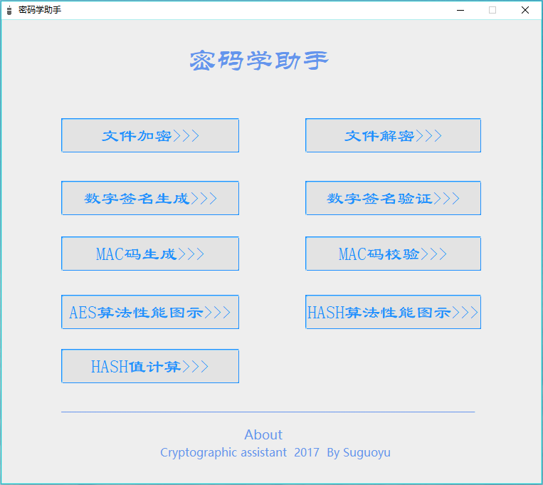
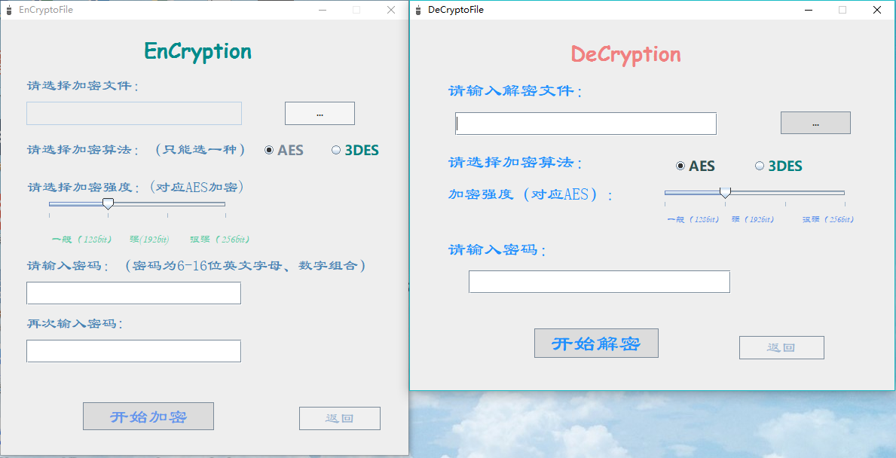
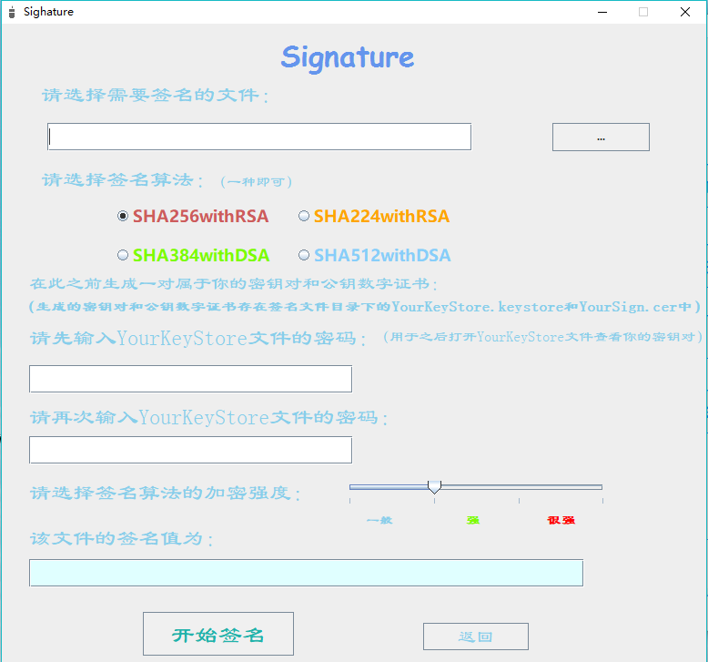
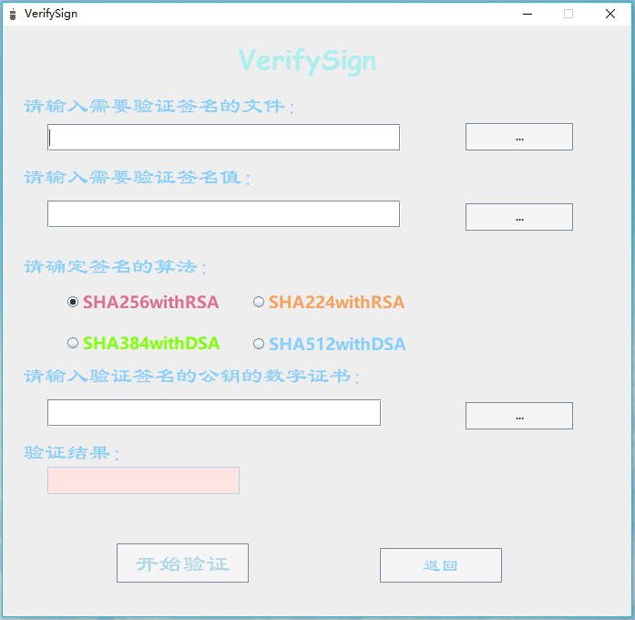
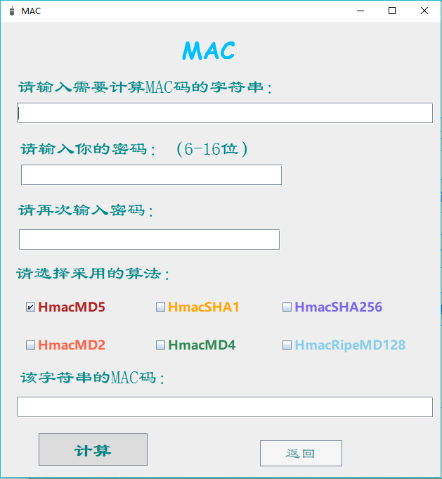

# MyCryptologyTool 自己写的密码学工具
 

### 文件加密解密
支持128bit,192bit,256bit强度的AES加密和3重DES加密

 

### 数字签名生成
支持两种不同加密强度的签名算法，同时支持自签名数字证书的生成

 

### 数字签名验证
对应数字签名生成的数字签名认证

 

### HAMC码计算
支持多种算法计算消息认证码

### HAMC码校验
对应生成消息认证码的校验

### 消息摘要值计算
支持多种Hash算法的消息摘要值计算

